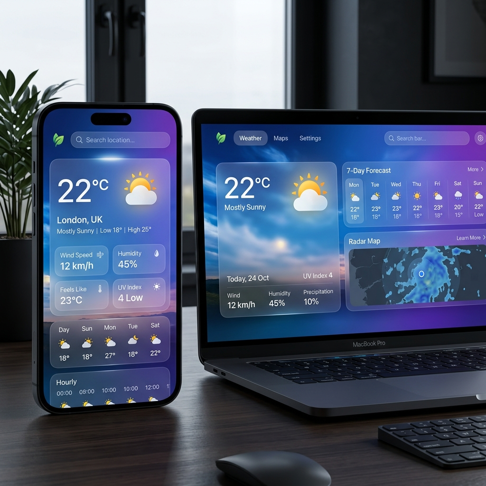

# 🌤️ TerraGuide: Premium Real-Time Weather Insights

TerraGuide is a high-performance, responsive weather application designed for modern users. It provides real-time atmospheric data, intuitive city-based searching, and a dynamic user interface that adapts visually to current weather conditions.

## 🚀 Key Features

- **📍 Real-Time Weather Data**: Fetches accurate temperature, humidity, wind speed, and atmospheric conditions for any searched city globally.
- **✨ Dynamic Background Themes**: Implements an intelligent UI system that automatically transitions background gradients and themes based on weather conditions (Clear, Clouds, Rain, Snow, etc.).
- **🌍 Location Auto-Detection**: Integrated Browser Geolocation API to instantly provide local weather insights upon application load.
- **📱 Responsive Glassmorphism Design**: A premium, mobile-first design built with Vanilla CSS, featuring blur effects, smooth animations, and a sleek modern aesthetic.
- **🕒 Search History**: Utilizes `localStorage` to persist recent searches, allowing users to quickly toggle between frequently checked locations.
- **🔄 Loading & Error Handling**: Robust error handling for invalid city names or connectivity issues, accompanied by smooth loading states.

## 🛠️ Tech Stack

- **Frontend**: HTML5, Vanilla CSS3 (Custom properties, Flexbox, Grid)
- **Logic**: Vanilla JavaScript (ES6+, Fetch API, Geolocation API, LocalStorage)
- **API**: [OpenWeatherMap REST API](https://openweathermap.org/api)
- **Typography**: [Google Fonts (Outfit)](https://fonts.google.com/specimen/Outfit)
- **Icons**: [Font Awesome 6](https://fontawesome.com/)

## 📦 Setup & Installation

1. **Clone the Repository**:
   ```bash
   git clone https://github.com/thakkerstuti/TerraGuide.git
   cd TerraGuide
   ```

2. **API Configuration**:
   - Obtain a free API Key from [OpenWeatherMap](https://home.openweathermap.org/users/sign_up).
   - Open `script.js` and replace `'YOUR_API_KEY'` with your actual API key on line 8.

3. **Run Locally**:
   - Simply open `index.html` in any modern web browser.
   - Alternatively, use a live server extension or run `npm run dev` if using the Vite development environment.

## 📸 Screenshots



- **Clear Weather**: Vibrant sunny gradients and glassmorphism.
- **Responsive Design**: Optimized for both mobile and desktop views.

---

**Developed with ❤️ for a sustainable and informed future.**
